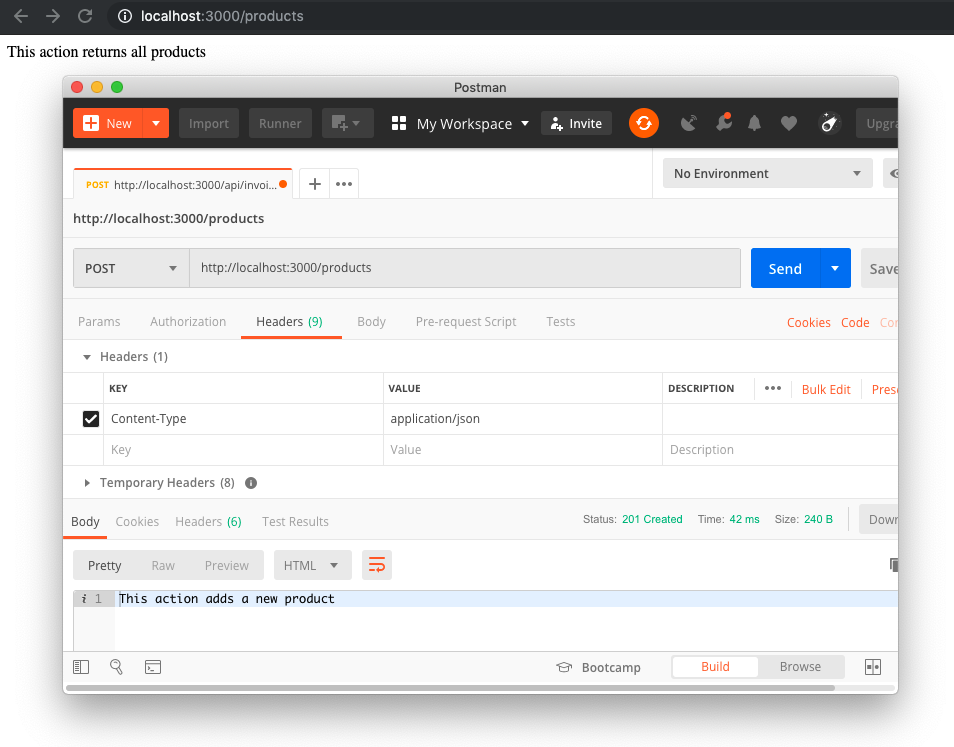

# NestJS

## Introduction

Theses are my NestJS adventures, noted down as I go and learn about NestJS.

My plan

- [x] getting started
- [ ] create a RESTful endpoint with integration tests
- [ ] create auth service
- [ ] connect with MongoDB
- [ ] play around with GraphQL

## Getting started

Assuming you have nothing installed, you will need:

1. git - you just gotta have git
2. nvm, node
3. mongodb
4. nest globally installed `npm i -g @nestjs/cli`

## Initial installation

After using `nest new project-name` we have (used `tree -I node_modules`)

```
├── README.md                    - documentation
├── nest-cli.json                -
├── package-lock.json            -
├── package.json                 - project configuration and scripts
├── src
│   ├── app.controller.spec.ts   - test file
│   ├── app.controller.ts        - Basic controller sample with a route.
│   ├── app.module.ts            - The root module of the application.
│   ├── app.service.ts
│   └── main.ts                  - The entry file of the application
├── test
│   ├── app.e2e-spec.ts
│   └── jest-e2e.json
├── tsconfig.build.json          - Typescript build config
├── tsconfig.json                - Typescript config
└── tslint.json                  - Typescript linting

```

Now is a good time to stick your stuff in git preferable using [Conventional Commits](https://www.conventionalcommits.org/en/v1.0.0-beta.4/)

## Initial running

`package.json` consists of a start script, but we want to see what is going on, so we add `DEBUG=*` before the start script

```
$ npm start

> nestjs@0.0.1 start /nestjs
> DEBUG=* nest start

  express:application set "x-powered-by" to true +0ms
  express:application set "etag" to 'weak' +2ms
  express:application set "etag fn" to [Function: generateETag] +0ms
  express:application set "env" to 'development' +1ms
  express:application set "query parser" to 'extended' +0ms
  express:application set "query parser fn" to [Function: parseExtendedQueryString] +0ms
  express:application set "subdomain offset" to 2 +0ms
  express:application set "trust proxy" to false +0ms
  express:application set "trust proxy fn" to [Function: trustNone] +0ms
  express:application booting in development mode +1ms
  express:application set "view" to [Function: View] +0ms
  express:application set "views" to '/nestjs/views' +0ms
  express:application set "jsonp callback name" to 'callback' +0ms
[Nest] 19599   - 02/11/2019, 14:56:52   [NestFactory] Starting Nest application...
[Nest] 19599   - 02/11/2019, 14:56:52   [InstanceLoader] AppModule dependencies initialized +10ms
  express:router use '/' query +26ms
  express:router:layer new '/' +0ms
  express:router use '/' expressInit +0ms
  express:router:layer new '/' +0ms
  express:router use '/' jsonParser +0ms
  express:router:layer new '/' +1ms
  express:router use '/' urlencodedParser +0ms
  express:router:layer new '/' +0ms
[Nest] 19599   - 02/11/2019, 14:56:52   [RoutesResolver] AppController {/}: +4ms
  express:router:route new '/' +2ms
  express:router:layer new '/' +0ms
  express:router:route get '/' +0ms
  express:router:layer new '/' +0ms
[Nest] 19599   - 02/11/2019, 14:56:52   [RouterExplorer] Mapped {/, GET} route +9ms
  express:router use '/' <anonymous> +9ms
  express:router:layer new '/' +0ms
  express:router use '/' <anonymous> +0ms
  express:router:layer new '/' +0ms
[Nest] 19599   - 02/11/2019, 14:56:52   [NestApplication] Nest application successfully started +2ms
```

note it uses the [factory pattern](https://dev.to/duranenmanuel/creating-objects-dynamically-with-factory-pattern-in-javascript-54ah)

Also NestJs uses [Typescript](https://dev.to/robertcoopercode/get-started-with-typescript-in-2019-6hd), [async/await](https://dev.to/gafi/7-reasons-to-always-use-async-await-over-plain-promises-tutorial-4ej9)

Hey look! a [similar tutorial](https://medium.com/@amitprabhu/rest-api-using-nestjs-c445d0abc91e) and [another adding GraphQL](https://dev.to/itminds/how-to-architecture-your-javascript-api-using-nestjs-with-a-graphql-api-example-part-1-2-2jcb)

## Adding path resolve

We would like to type:

`import idk from '@src/module'`

and avoid: `import idk from '../../../whatever/module'`

Therefore we need to create an alias '@src' using [module-alias](https://www.npmjs.com/package/module-alias) and follow [this](https://dev.to/larswaechter/path-aliases-with-typescript-in-nodejs-4353) tutorial;

- [x] install `modules-alias`, `npm i -s module-alias`
- [x] update `./tsconfig.json`: `"baseUrl": "./src", "paths": { "@src/*": ["./*"] },`
- [x] add to `./package.json`: `"_moduleAliases": { "@src": "dist" }`
- [x] add to `src/main.ts`: `import 'module-alias/register';`

## Consolidate configuration in a config file:

- [x] create folder `src/config`
- [x] create file `src/config/constants.ts`:

```ts
export const KEYS = {
  mongodb_connection_uri: 'mongodb://localhost:27017/nestjs',
};
```

## Add MongoDB and Mongoose

I used `@nestjs/mongoose` using [this](https://medium.com/javascript-in-plain-english/a-crash-course-in-nestjs-cccfc0090a16) tutorial. Using [this commit](https://github.com/rkristelijn/nestjs/commit/b6b197b46dc493648a61aa317d2940f51f5d1311) you can get it up and running, but this readme is now outdated.

- [x] add module `database` by typing `nest g module database`
- [x] I THINK OPTIONAL: add folder `src/database`
- [x] add file `src/database/database.providers.ts`:

```ts
import * as mongoose from 'mongoose';
import { KEYS } from '@src/config/config.constants';

export const DATABASE_CONNECTION = 'DATABASE_CONNECTION';

export const databaseProviders = [
  {
    provide: DATABASE_CONNECTION,
    useFactory: (): Promise<typeof mongoose> =>
      mongoose.connect(KEYS.mongodb_connection_uri, {
        useNewUrlParser: true,
        useUnifiedTopology: true,
      }),
  },
];
```

- [x] update the database module `src/database/database.module.ts`:

```ts
import { Module } from '@nestjs/common';
import {
  databaseProviders,
  DATABASE_CONNECTION,
} from '@src/database/database.providers';

@Module({
  providers: [...databaseProviders],
  exports: [DATABASE_CONNECTION],
})
export class DatabaseModule {}
```

## Adding Products Interface and Schema

- [x] add module `products` by typing `nest g module product`
- [x] create `src/products/products.interface.ts`:

```ts
import { Document } from 'mongoose';

export interface Product {
  title: string;
  brand: string;
  currentPrice: number;
}

export interface ProductDocument extends Document, Product {}
```

- [x] create `src/products/products.schema.ts`:

```ts
import { ObjectId } from 'mongodb';
import { Model, Schema } from 'mongoose';
import { ProductDocument } from './products.interface';

export const ProductSchema = new Schema({
  _id: { type: ObjectId, auto: true },
  title: String,
  brand: String,
  currentPrice: Number,
});

export type ProductModel = Model<ProductDocument>;
```

## Add the products Provider

- [x] create `src/products/products.provider.ts`:

```ts
import { Connection } from 'mongoose';
import { ProductSchema } from './products.schema';
import { DATABASE_CONNECTION } from '@src/database/database.providers';

export const PRODUCT_MODEL = 'PRODUCT_MODEL';

export const productsProviders = [
  {
    provide: PRODUCT_MODEL,
    useFactory: (connection: Connection) =>
      connection.model('Product', ProductSchema),
    inject: [DATABASE_CONNECTION],
  },
];
```

- [x] update `src/products/products.module.ts`:

```ts
import { Module } from '@nestjs/common';
import { DatabaseModule } from '@src/database/database.module';
import { productsProviders } from '@src/products/products.providers';

@Module({
  imports: [DatabaseModule],
  providers: [...productsProviders],
})
export class ProductsModule {}
```

## Add the products controller

- [x] create file `src/products/products.controller.ts`:

```ts
import { Controller, Get, Post } from '@nestjs/common';

@Controller('products')
export class ProductsController {
  @Post()
  create(): string {
    return 'This action adds a new product';
  }

  @Get()
  findAll(): string {
    return 'This action returns all products';
  }
}
```

- [x] update `src/app.module.ts`:

```ts
import { Module } from '@nestjs/common';
import { AppController } from './app.controller';
import { AppService } from './app.service';
import { ProductsModule } from './products/products.module';
import { ProductsController } from './products/products.controller'; // << add this line
import { DatabaseModule } from './database/database.module';

@Module({
  imports: [ProductsModule, DatabaseModule],
  controllers: [AppController, ProductsController], // << add productsController
  providers: [AppService],
})
export class AppModule {}
```

- [x] start your app using `npm run start:dev` and test your work:



if you get an error: `Cannot find module 'dist/main.js'`, run `npm run build` to refresh the dist folder.

## Connect Mongo to the controller

- [x] execute `nest g service products`:

```
CREATE /src/products/products.service.spec.ts (474 bytes)
CREATE /src/products/products.service.ts (92 bytes)
UPDATE /src/products/products.module.ts (357 bytes)
```

## Original Readme

<p align="center">
  <a href="http://nestjs.com/" target="blank"></a>
</p>

[travis-image]: https://api.travis-ci.org/nestjs/nest.svg?branch=master
[travis-url]: https://travis-ci.org/nestjs/nest
[linux-image]: https://img.shields.io/travis/nestjs/nest/master.svg?label=linux
[linux-url]: https://travis-ci.org/nestjs/nest

  <p align="center">A progressive <a href="http://nodejs.org" target="blank">Node.js</a> framework for building efficient and scalable server-side applications, heavily inspired by <a href="https://angular.io" target="blank">Angular</a>.</p>
    <p align="center">
<a href="https://www.npmjs.com/~nestjscore"></a>
<a href="https://www.npmjs.com/~nestjscore"></a>
<a href="https://www.npmjs.com/~nestjscore"></a>
<a href="https://travis-ci.org/nestjs/nest"></a>
<a href="https://travis-ci.org/nestjs/nest"></a>
<a href="https://coveralls.io/github/nestjs/nest?branch=master"></a>
<a href="https://gitter.im/nestjs/nestjs?utm_source=badge&utm_medium=badge&utm_campaign=pr-badge&utm_content=body_badge"></a>
<a href="https://opencollective.com/nest#backer"></a>
<a href="https://opencollective.com/nest#sponsor"></a>
  <a href="https://paypal.me/kamilmysliwiec"></a>
  <a href="https://twitter.com/nestframework"></a>
</p>
  <!--[](https://opencollective.com/nest#backer)
  [](https://opencollective.com/nest#sponsor)-->

## Description

[Nest](https://github.com/nestjs/nest) framework TypeScript starter repository.

## Installation

```bash
$ npm install
```

## Running the app

```bash
# development
$ npm run start

# watch mode
$ npm run start:dev

# production mode
$ npm run start:prod
```

## Test

```bash
# unit tests
$ npm run test

# e2e tests
$ npm run test:e2e

# test coverage
$ npm run test:cov
```

## Support

Nest is an MIT-licensed open source project. It can grow thanks to the sponsors and support by the amazing backers. If you'd like to join them, please [read more here](https://docs.nestjs.com/support).

## Stay in touch

- Author - [Kamil Myśliwiec](https://kamilmysliwiec.com)
- Website - [https://nestjs.com](https://nestjs.com/)
- Twitter - [@nestframework](https://twitter.com/nestframework)

## License

Nest is [MIT licensed](LICENSE).
